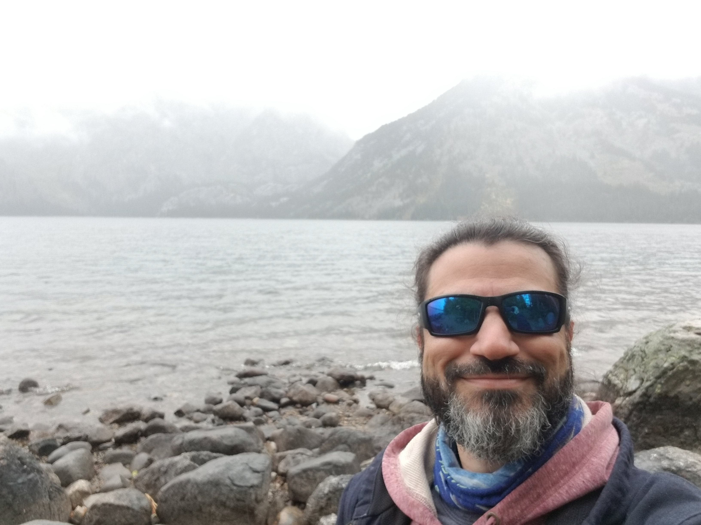

# PogoDummies
Reading through GitHub for Dummies

## About me
In my lifelong journey of learning, I am teaching myself how to do some coding. I started with some C++ and now am now working through the Rust Documentation. I picked up the GitHub for Dummies book from the library and this repository is where I intend to practice the content.

## Career Goals
I want to engage more fully with open source content; contribute to an existing project and start my own. I want to flesh out my self directed learning with some industry certifications in the future and build a portfolio of work to share with the world.

## My Hobbies
I enjoy reading Science Fiction and Fantasy novels when I'm not reading challenging learning topics. Evenings can be spent on multiplayer video games to keep in touch with friends I've met through the years. When scheduling permits, I love to do a session of Tabletop Roleplaying Games.
